<div align="center">

<a href="https://kmads.dev/notes">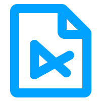</a>

# notes

**A real code editor in a browser tab.**<br>
VS Code's editor engine, live previews for a dozen formats, saves straight back to disk. One HTML file, no install, no account, no server.

[**Open notes →**](https://kmads.dev/notes)
&nbsp;·&nbsp; [Watch the 37-second tour](assets/video/notes-desktop.mp4)
&nbsp;·&nbsp; [Report a bug](https://github.com/kmadsdev/notes/issues/new?template=bug_report.yml)
&nbsp;·&nbsp; [Request a feature](https://github.com/kmadsdev/notes/issues/new?template=feature_request.yml)

[](LICENSE)
[](index.html)
[](#self-hosting)
[](CONTRIBUTING.md)
[](https://github.com/kmadsdev/notes/stargazers)

<br>

<a href="assets/video/notes-desktop.mp4">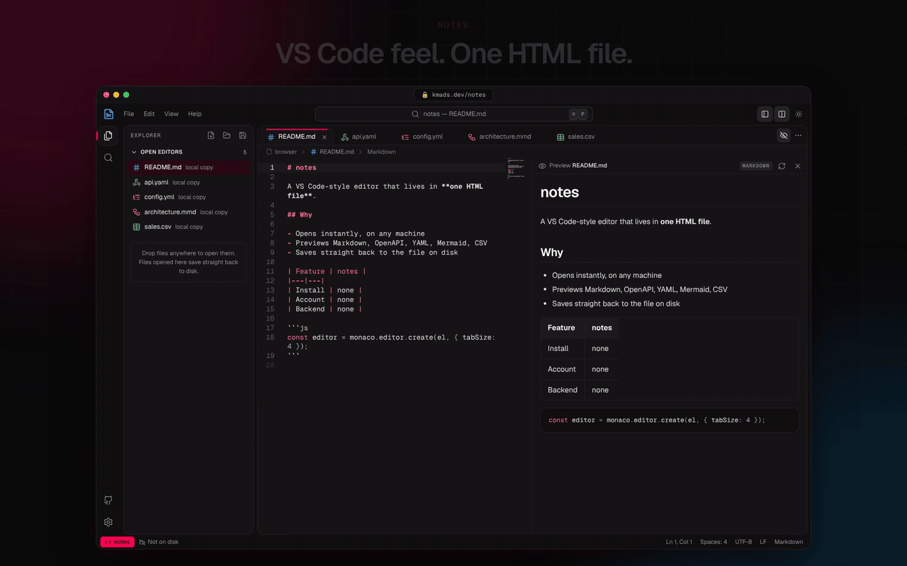</a>

</div>

---

## Why notes?

Sometimes you just need to look at a file. A YAML config someone pasted in chat, an OpenAPI spec you want to browse, a README you're about to push, a Mermaid diagram you're sketching. Opening a full IDE is slow, online editors want an account, and plain textareas don't know what YAML is.

notes is the fast option in between:

- **Instant.** Open the URL and start typing. Nothing to install, no sign-in, no project to set up.
- **Real editing.** It's [Monaco](https://microsoft.github.io/monaco-editor/), the editor inside VS Code: multi-cursor, find and replace, folding, bracket colors, IntelliSense for JS/TS/JSON/CSS/HTML, and syntax highlighting for 80+ languages.
- **It renders what you write.** Markdown, OpenAPI, YAML, JSON, Mermaid, PlantUML, CSV, HTML and SVG get a live preview beside the editor (or full screen on a phone).
- **Your files stay yours.** Nothing is uploaded. In Chrome and Edge, a file you open is saved back to the same file on disk.
- **It's one file.** The whole app is [`index.html`](index.html). Read it, fork it, host it anywhere static, or drop it on a USB stick.

## Features

| | |
|---|---|
| 🧭 **VS Code layout** | Title bar with menus and a command center, activity bar, Explorer / Search / Settings side bar, tabs, breadcrumbs and a status bar. |
| ⌨️ **Command palette** | Every action lives in one searchable list (`Ctrl/⌘ Shift P`). Quick open (`Ctrl/⌘ P`), go to line (`:42`). |
| 📝 **Name first, rename anytime** | New files ask for a name, so the right language and preview kick in from the first keystroke. Double-click a tab or an Explorer entry to rename it; the name is validated as you type. |
| 👁️ **Live previews** | Double-buffered, sandboxed previews that patch in place as you type, so there's no flicker and scroll position survives. Markdown scroll follows the editor. |
| 💾 **Saves to disk** | Uses the [File System Access API](https://developer.mozilla.org/docs/Web/API/File_System_API) in Chromium browsers: open a file, edit, and it autosaves back to the original. Other browsers get one-click download. |
| ↹ **Indentation that behaves** | New files use 4 spaces (configurable). Opened files keep the indentation they already use. Makefiles and Go get tabs, YAML gets spaces. Override any file from the status bar. |
| 🔎 **Search** | Across all open files, with match case, whole word and regex toggles. |
| ♻️ **Session restore** | Tabs and unsaved text come back after a reload. It's stored only in your browser. |
| 🌗 **Dark and light** | Two themes built on the [Workaholic Design System](https://github.com/kmadsdev/ruph), or follow your OS setting. Previews follow the theme too. |
| 📱 **Works on phones** | Drawer side bar, 44 px touch targets, full-screen preview toggle, and no zoom-on-focus on iOS. |

### Previews

| Format | Files | Renderer |
|---|---|---|
| Markdown | `.md`, `.markdown`, `.mdx` | GitHub-style: tables, task lists, front matter, colored code blocks and ```` ```mermaid ```` blocks |
| OpenAPI 3 / Swagger 2 | `.yaml`, `.yml`, `.json` with an `openapi:` or `swagger:` key | [Swagger UI](https://swagger.io/tools/swagger-ui/), updated live |
| YAML (multi-document too) and JSON | `.yaml`, `.yml`, `.json`, `.jsonc` | Collapsible tree |
| Mermaid | `.mmd`, `.mermaid` | [Mermaid](https://mermaid.js.org/) diagrams |
| PlantUML | `.puml`, `.plantuml`, `.pu`, `.iuml` | PlantUML server (configurable, see [Privacy](#privacy)) |
| CSV / TSV | `.csv`, `.tsv` | Table with numeric columns aligned |
| HTML | `.html`, `.htm` | Sandboxed page (scripts run, with no access to notes) |
| SVG | `.svg` | Image on a checkerboard |

<table>
  <tr>
    <td width="50%">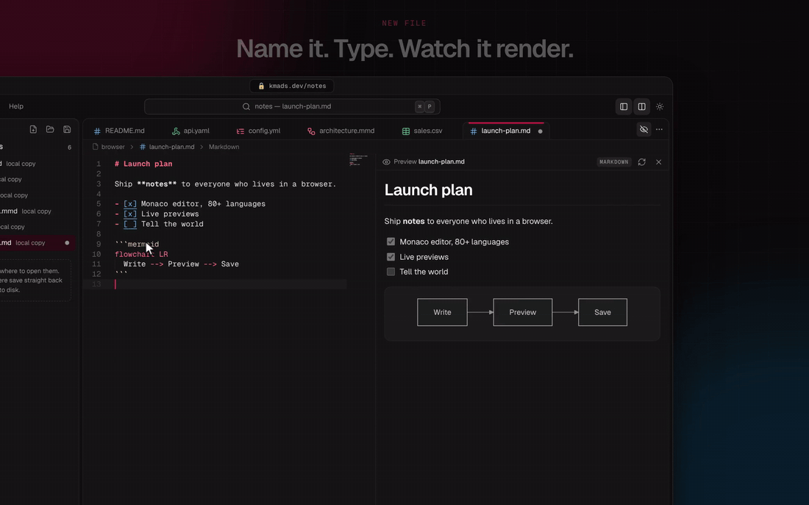</td>
    <td width="50%" align="center">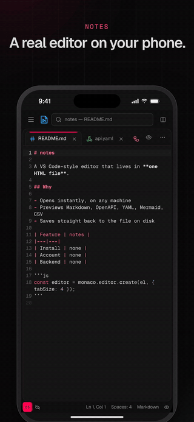</td>
  </tr>
  <tr>
    <td align="center"><sub>Every preview updates as you type</sub></td>
    <td align="center"><sub>The same editor on a phone</sub></td>
  </tr>
</table>

### Screenshots

| | |
|---|---|
| 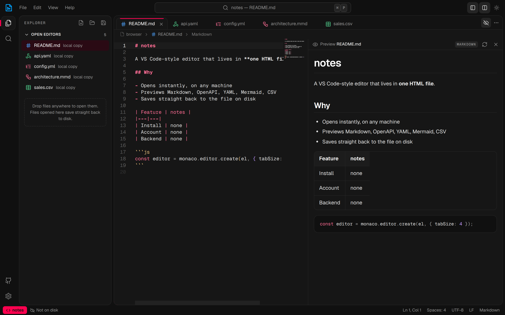 | 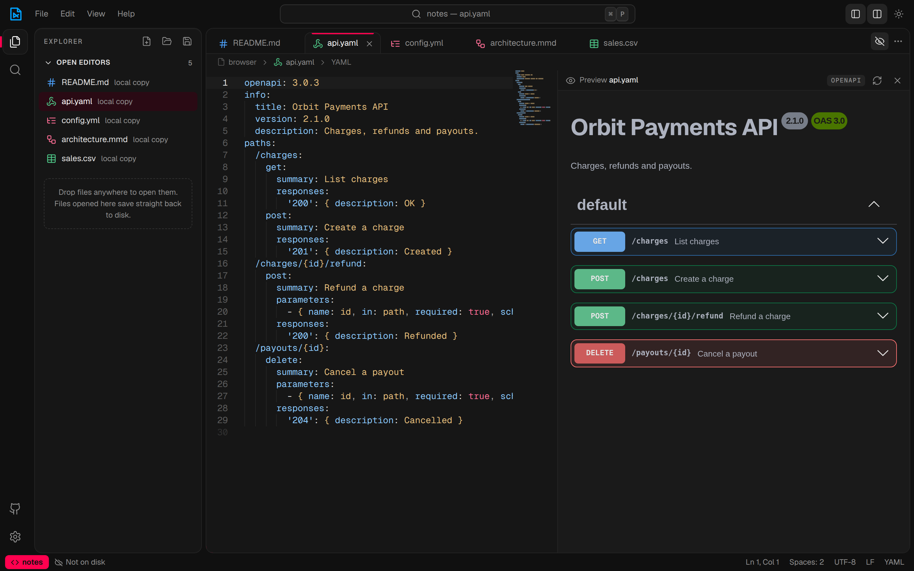 |
| 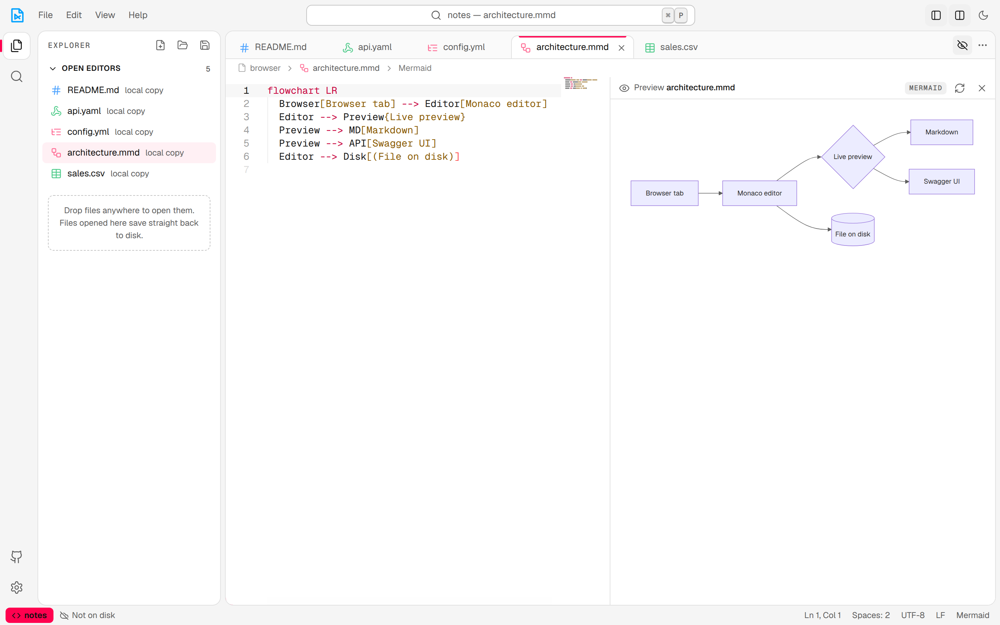 | 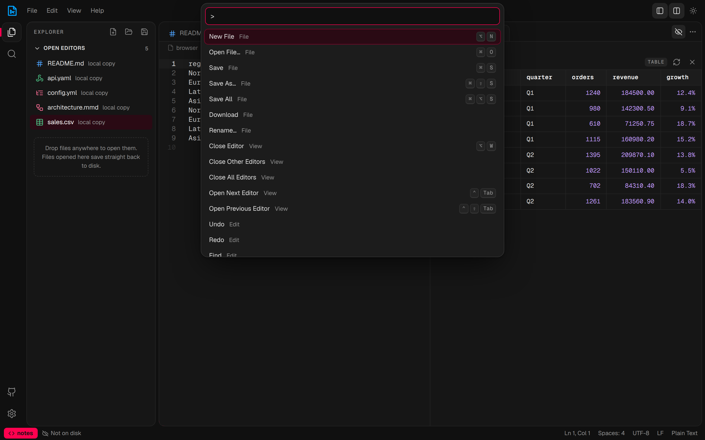 |

<p align="center">
  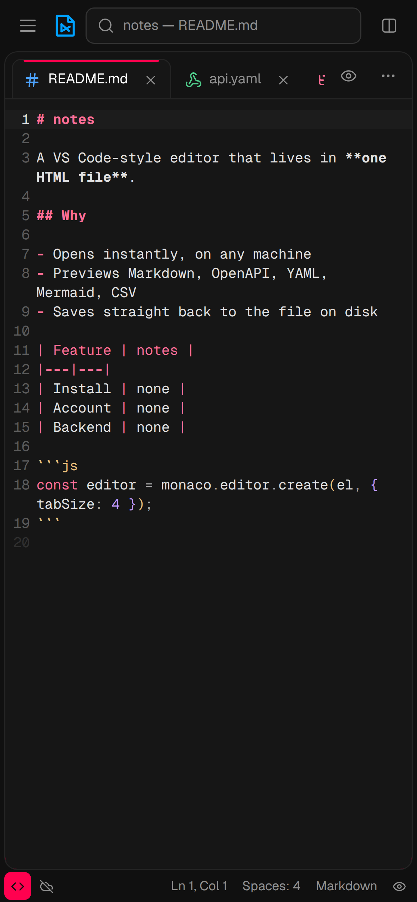
  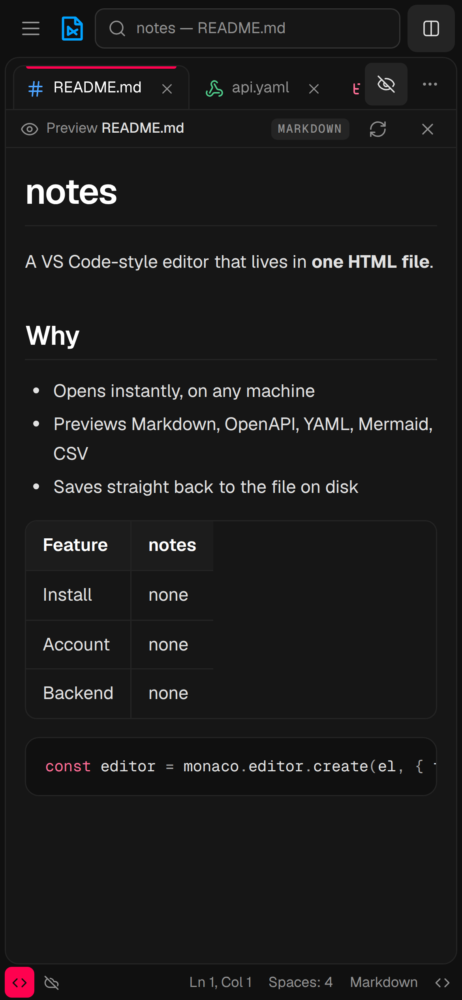
  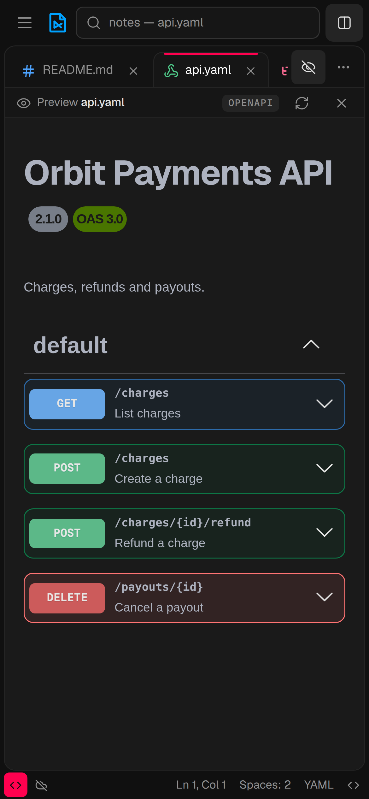
  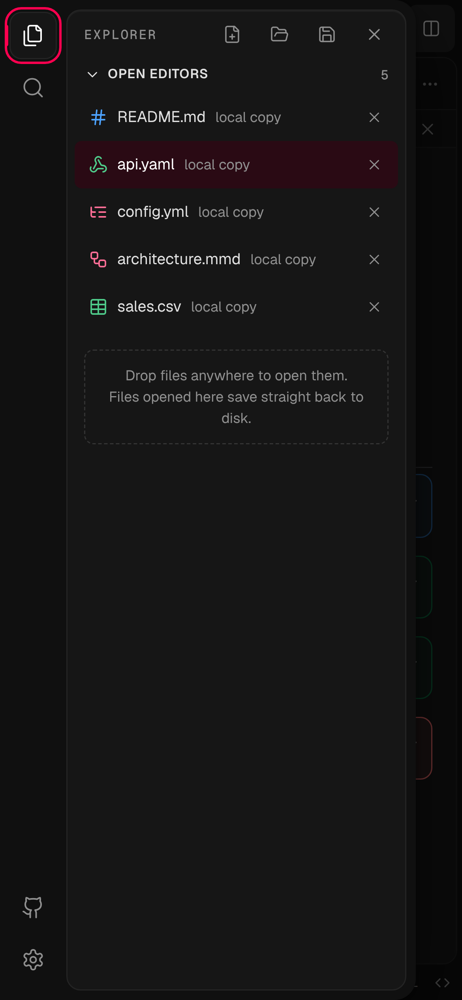
</p>

### Launch videos

- [Desktop tour (37 s, 1920×1200)](assets/video/notes-desktop.mp4)
- [iPhone tour (34 s, 1080×2340)](assets/video/notes-mobile.mp4)

## Getting started

**Use it:** open **[kmads.dev/notes](https://kmads.dev/notes)**. That's it. Drop a file anywhere on the window to open it, or press `Alt N` for a new one.

### Self-hosting

notes is a static page. Any web server works:

```sh
git clone https://github.com/kmadsdev/notes.git
cd notes
npx http-server .        # or: python3 -m http.server 8080
```

Then open `http://localhost:8080`. To publish it, put `index.html` and `notes.svg` on GitHub Pages, Netlify, Cloudflare Pages, S3 or an nginx folder.

Saving to disk needs a [secure context](https://developer.mozilla.org/docs/Web/Security/Secure_Contexts) (`https://` or `localhost`). Opening `index.html` straight from the file system also works, but only with download-style saving.

Libraries load from [jsDelivr](https://www.jsdelivr.com/) at pinned versions, so the first visit needs a network connection.

## Keyboard shortcuts

| Action | Windows / Linux | macOS |
|---|---|---|
| Command palette | `Ctrl Shift P`, `F1` | `⌘ ⇧ P`, `F1` |
| Go to file | `Ctrl P` | `⌘ P` |
| Go to line | `Ctrl G` | `⌘ G` |
| New file | `Alt N` | `⌥ N` |
| Open / Save / Save As | `Ctrl O` / `Ctrl S` / `Ctrl Shift S` | `⌘ O` / `⌘ S` / `⌘ ⇧ S` |
| Save all | `Ctrl Alt S` | `⌘ ⌥ S` |
| Close editor / Reopen closed | `Alt W` / `Alt Shift T` | `⌥ W` / `⌥ ⇧ T` |
| Next / previous editor | `Ctrl Tab` / `Ctrl Shift Tab` | `⌃ Tab` / `⌃ ⇧ Tab` |
| Toggle preview | `Ctrl Shift V` or `Ctrl \` | `⌘ ⇧ V` or `⌘ \` |
| Toggle side bar | `Ctrl B` | `⌘ B` |
| Explorer / Search / Settings | `Ctrl Shift E` / `Ctrl Shift F` / `Ctrl ,` | `⌘ ⇧ E` / `⌘ ⇧ F` / `⌘ ,` |
| Format document | `Shift Alt F` | `⇧ ⌥ F` |
| Word wrap | `Alt Z` | `⌥ Z` |
| Rename file | double-click its tab or Explorer entry, or click its name in the breadcrumbs | same |

Browsers reserve `Ctrl N` and `Ctrl W` for themselves, which is why the `Alt` versions exist. Everything else in Monaco (multi-cursor, `Ctrl D`, `Alt ↑/↓`, folding and so on) works as it does in VS Code.

## Browser support

| | Chrome / Edge | Firefox | Safari (macOS / iOS) |
|---|:---:|:---:|:---:|
| Edit, preview, download | ✅ | ✅ | ✅ |
| Session restore | ✅ | ✅ | ✅ |
| Save back to the original file | ✅ | — | — |

Browsers without the File System Access API save with a download instead.

## Privacy

notes has no backend, no analytics and no cookies. Files never leave your device, with **one exception**: to draw a PlantUML diagram, its source is sent to a PlantUML render server (the public [plantuml.com](https://www.plantuml.com) server by default). You can point it at your own server under **Settings → Preview → PlantUML server**, for example `docker run -p 8080:8080 plantuml/plantuml-server`.

What stays in your browser:

- `localStorage`: your settings and the text of open tabs, for session restore (turn it off under **Settings → Files**).
- IndexedDB: the file handles that let notes save back to files you opened.

## How it works

Everything is in [`index.html`](index.html): markup, styles and about 3,000 lines of plain JavaScript. There are no frameworks and no build.

- **Editor:** Monaco 0.52 (AMD build). Each tab owns a Monaco model at `file:///<id>/<name>`, so the TypeScript worker sees real extensions (JSX and TSX work).
- **Previews:** two sandboxed iframes (`allow-scripts`, no same-origin) take turns. The hidden one renders and the frames swap when it's ready. While you type, notes posts the new body into the visible frame instead of reloading it, and Swagger UI gets spec updates in place. Mermaid output is cached by source.
- **Libraries** load only when a preview needs them: marked + DOMPurify, js-yaml, pako, Swagger UI and Mermaid, all pinned.
- **Commands:** one registry feeds the palette, the menus and the keybindings.

[`CLAUDE.md`](CLAUDE.md) goes into more detail and is the best map of the code.

## Roadmap

Ideas we'd like to build. Issues and PRs are welcome:

- [ ] Offline support with a service worker, so the app works with no network after the first visit
- [ ] Open a whole folder (directory picker) with a file tree
- [ ] Export the preview to PDF / HTML
- [ ] Share a snippet through a URL fragment (`#…`), with nothing stored on a server
- [ ] More previews: GraphViz / DOT, AsyncAPI, TOML tree

## Contributing

Bug reports, ideas and pull requests are all welcome. [`CONTRIBUTING.md`](CONTRIBUTING.md) explains how to run notes locally, the few rules the codebase follows (one file, pinned CDN libraries, no build step) and what a good PR looks like.

Please read the [Code of Conduct](CODE_OF_CONDUCT.md) before taking part, and report security issues privately as described in [`SECURITY.md`](SECURITY.md).

## Credits

notes is built on the shoulders of excellent open source:
[Monaco Editor](https://github.com/microsoft/monaco-editor) ·
[marked](https://github.com/markedjs/marked) ·
[DOMPurify](https://github.com/cure53/DOMPurify) ·
[js-yaml](https://github.com/nodeca/js-yaml) ·
[Swagger UI](https://github.com/swagger-api/swagger-ui) ·
[Mermaid](https://github.com/mermaid-js/mermaid) ·
[PlantUML](https://plantuml.com) ·
[pako](https://github.com/nodeca/pako) ·
[Lucide](https://lucide.dev) icons ·
[Geist](https://vercel.com/font) type.
The UI follows the Workaholic Design System from [kmadsdev/ruph](https://github.com/kmadsdev/ruph).

## License

[MIT](LICENSE) © kmadsdev
